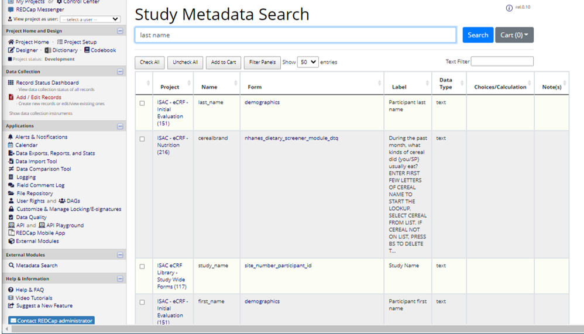

# Marcus Institute - Study Metadata Search - REDCap External Module
## Purpose
The purpose of the REDCap module is to provide search functionality of metadata (data dictionaries) across projects or curated libraries of forms. Once installed and configured at the system level, individual projects may opt-in to share all or some of the metadata associated with project forms.  The search engine indexes the metadata (field name, label, notes, etc.) and makes these data available through a simple search bar.  

All authenticated REDCap users, with project-level access, may use the search interface.  Users may select individual fields or whole forms and add them to a shopping cart.  The cart may be downloaded in REDCap data dictionary-template format.  The downloaded dictionary(s) may then be used to build new project databases.  
### Developer Information
Please contact the Director of Research Informatics (ifar-informatics@hsl.harvard.edu) at the Marcus Institute for more information.  
## Requirements / Caveats
Currently, the external module uses the Php-Search Engine (https://github.com/VincentFoulon80/php-search), which provides basic search engine capabilities, which requires minimal local server configuration.  
+ Local file system access is required for storing the search engine index and document cache. 
### Caveats
+ Search engine optimization is not currently supported. Support for custom weighted indexes or additional search attributes may be added in future releases
+ Custom or external engines (AWS CloudSearch, TnTSearch, Elastic, etc.) are not supported
## Configuration Details
The external module must be installed and configured at the system and project level. [System-level](#system-level) configuration defines the storage location and automatic reindex schedule for the search engine.  [Project-level](#project-level) configuration controls opting into the search algorithm as well as controlling specific forms shared with the enterprise.

### System Level
The following configuration settings must be set by the REDCap administrator in coordination with the REDCap IT systems administrator.  

| Property | Description | Options |
|----------|----------------------------------|--------|
| Search Engine (search-provider) | Underlying search engine library | PhpSearchEngine (only v0.x-v1.x)
| Temp Folder Location (temp-folder) | File system location where search engine will store index files and document cache. Custom paths must be read-write by the underlying Web server (same as php-temp). | + System (see php.ini or ```sys_get_temp_dir()``` function)&nbsp; + REDCap (see ```APP_PATH_TEMP``` setting in Control Center) &nbsp; + Custom |
| Automatic Reindex/Rebuild (autorebuild-enabled) | Allows REDCap to automatically reindex all opt-in projects using the built in CRON system | |
| Automatic Reindex CRON Pattern (autorebuild-pattern) | Any valid CRON pattern | (see https://github.com/dragonmantank/cron-expression) |

#### API Keys
API keys are optional. See Search API below when specified.
| Property | Description | Example |
|----------|----------------------------------|--------|
| Key (api-key) | Primary, unique key for use on API calls (GUID or random sequence recommened) | ``` 00394e6e-ca12-478f-a4a4-4fd00b771379 ``` |
| Name (api-name) | Common name or explaination of API token | ``` Developer key ``` |

### Project Level
The following configuration settings may be set by project administrators.  
| Property | Description | Example |
|----------|----------------------------------|--------|
| Index Enabled (index-enabled) | Permits the search engine to index all or some (see denylist) metadata from being included in enterprise search results||
| Denylist (forms-denylist) | By default, all forms are included in search indexing.  The denylist allows project administrators to exclude specific forms from the index.  A comma separated list is expected.  Lists may use patterns (see PHP ```fnmatch()```) to perform wildcard exclusions. | ```form1,form2*``` - Excludes form1 and all form2 (e.g. form2a, form2b, etc.) |

## Automatic Reindex via REDCap Cron
The module leverages the built-in REDCap CRON system to continuously monitor and rebuild the search index.  The index process may consume considerable Web server resources and therefore the module may only be run automatically once a day.  By default, the automatic reindex occurs weekly.  The "autorebuild-pattern" system-level confugration accepts any Unix CRON pattern (see https://crontab.cronhub.io/).

## Screenshots

### Search Interface


#### Cart


### Control Center
The module provides a control-center link which displays the following.
+ Search engine settings
+ List of all projects, index status and document count
+ Search engine statistics (document count, indexes, etc.)
  + Manual reindex feature
+ Log history (reindex and search requests)
+ CRON details (schedule, next run date, etc.)
+ Link to search engine. Link may be shared or added to Custom Application Link list
  


## Search API
Search API is not fully tested or supported.   

